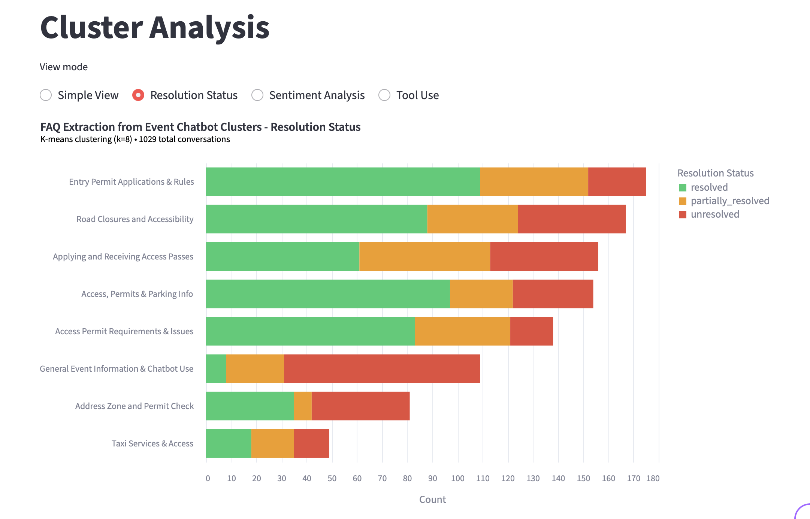

# FAQ Extraction Pipeline

[](https://www.python.org/)
[](https://cloud.google.com/vertex-ai)
[](https://opensource.org/licenses/MIT)

AI-powered pipeline to extract and deduplicate FAQs from any chatbot conversation data. Clusters topics, generates insights, and produces clean FAQ lists.



---

## Quick Start

### Prerequisites

- Python 3.11+
- Google Cloud SDK (for Vertex AI authentication)
- Docker

### 1. Install with uv

```bash
# Install uv (if not installed)
curl -LsSf https://astral.sh/uv/install.sh | sh

# # Or if you use Homebrew (macOS)
# brew install uv

# Install dependencies
uv sync

# Install pre-commit hooks
uv run pre-commit install
```

### 2. Start Qdrant

```bash
docker compose up -d
```

Verify: `curl http://localhost:6333/health`

### 3. Configure

Create a .env file and replace with the correct values.

```bash
cp .env.example .env
```

Authenticate with Google Cloud (for Vertex AI):

```bash
gcloud auth application-default login
```

Edit `config.yaml` to adjust settings (paths, clustering method, etc.).

### 4. Run Pipeline

**Important**: Before running, there should be a chat_history file in `dataset/chat_history.json`

Run the complete pipeline

```bash
uv run python -m run_pipeline
```

**Note**: optionally use flag `--skip-deduplication` to skip the last step and significantly cut the time the process takes.

(Instead of running with uv run, you can activate the .venv first)

```bash
source .venv/bin/activate # (MacOS)
# or .venv\Scripts\activate # (Windows)

# and then
python -m run_pipeline
```

### 5. Run Streamlit App

**Important:** Run after the pipeline has finished running.

```bash
uv run streamlit run streamlit_app/app.py
```

### 6. Stop Qdrant

```bash
docker compose down
```

---

## Adapt to Your Domain

The pipeline is **domain-agnostic** — it works with any chatbot conversation data. All domain-specific configuration is centralized in `config.yaml`.

### Three Steps to Analyze Your Chatbot

1. **Add your chat history**

   Place your `chat_history.json` in `dataset/`

   **Note:** If your chat history has a different structure, modify `clean_data.py` or implement a small adapter script.

2. **Configure your domain** in `config.yaml`:

   ```yaml
   domain:
     project_name: "Your Project Name" # Used in chart titles and Streamlit app
     general_context: |
       Description of your chatbot domain — what it does, target users,
       language, and any relevant context for the LLM agents.
   ```

3. **Run the pipeline and explore results**

   ```bash
   uv run python -m run_pipeline
   uv run streamlit run streamlit_app/app.py
   ```

<!--
## Case Study

-->

---

## Technical Reference

### Pipeline Steps

| #   | Step                    | Description                                          |
| --- | ----------------------- | ---------------------------------------------------- |
| 1   | `clean_data`            | Parse raw chat JSON into conversations + transcripts |
| 2   | `extract_issues`        | Extract structured issues using LLM                  |
| 3   | `build_embeddings`      | Generate embeddings, store in Qdrant                 |
| 4   | `reduce_dimensions`     | PCA dimensionality reduction                         |
| 5   | `cluster_embeddings`    | K-Means or HDBSCAN clustering                        |
| 6   | `name_clusters`         | Name clusters using LLM                              |
| 7   | `top_issues`            | Rank issues by proximity to cluster centroid         |
| 8   | `compute_cluster_stats` | Pre-compute cluster statistics for visualizations    |
| 9   | `visualize_clusters`    | Create visualizations                                |
| 10  | `statistical_analysis`  | Usage stats, correlations, chi-square tests          |
| 11  | `deduplicate_faqs`      | Deduplicate FAQ questions and synthesize clean FAQs  |

> **Note:** The `top_issues` step is automatically skipped when using HDBSCAN clustering.
> This step ranks issues by distance to cluster centroid, which is meaningful for K-Means
> (centroid-based) but not for HDBSCAN (density-based clustering).

> **Note:** The `statistical_analysis` step is automatically skipped in snippet mode.

### CLI Usage

```bash
# Run full pipeline
uv run python -m run_pipeline

# Run on a snippet (e.g., 100 random conversations)
uv run python -m run_pipeline --snippet 100

# Preview without running
uv run python -m run_pipeline --dry-run

# Run specific steps
uv run python -m run_pipeline --steps clean_data extract_issues

# Run from a step onwards
uv run python -m run_pipeline --from build_embeddings

# List all steps
uv run python -m run_pipeline --list

# Add sentiment/resolution/steps to existing reports (parallel, fast)
uv run python -m run_pipeline --enrich-only

# Add tags with pooling to existing reports (sequential, consistent)
uv run python -m run_pipeline --tag-only

# Force recreate a step or sequence of steps with --recreate
uv run python -m run_pipeline --recreate
uv run python -m run_pipeline --steps cluster_embeddings --recreate
uv run python -m run_pipeline --from top_issues --recreate

```

Run individual steps standalone for testing:

```bash
python -m src.pipeline.clean_data
python -m src.pipeline.extract_issues
# etc.
```

**Important:** If you change `paths.raw_data` to a different dataset, you MUST run with `--recreate`
to regenerate embeddings. Otherwise, cached embeddings from the previous dataset will be reused.

#### Enrich Only Mode

Add sentiment, resolution status, and agent steps to existing reports (runs in **parallel**, fast).

**Note:** enabled by default

```bash
uv run python -m run_pipeline --enrich-only
```

#### Tag Only Mode

Add tags with pooling to existing reports (runs **sequentially** to maintain consistent tag vocabulary).

**Note:** disabled by default

```bash
uv run python -m run_pipeline --tag-only
```

> **Note:** Both commands automatically regenerate stats and visualizations after processing.

**The enriched fields are required for:**

- `resolution_status`, `user_sentiment` → Statistical analyses (correlation, chi-square)
- `tags` → Tag word cloud visualization

#### Snippet Mode

Use `--snippet N` to run on a random sample of N conversations for faster testing/development. When snippet mode is enabled:

- A snippet dataset is created and cached (e.g., `chat_history_SNIPPET_100_conv.json`)
- All outputs get the suffix `_SNIPPET_{N}_conv` (e.g., `faq_clusters_SNIPPET_100_conv.png`)
- Clustering/PCA parameters are scaled proportionally (`ratio = snippet_size / full_size`)
- The same snippet is reused across runs (deterministic with configurable seed)

### Standalone Scripts

#### Usage Statistics

Generate comprehensive statistics from raw chat history (independent of pipeline):

```bash
python -m src.analysis.get_usage_statistics
```

Outputs: `data/output/chat_history_stats.json`

Statistics include:

- Conversation counts and message distributions
- Message length analysis
- Feature usage (tools, citations)
- Temporal patterns (by date, hour, weekday)

**Note:** enabled by default

#### Executive Report

Generate an LLM-powered executive summary with key insights from usage statistics and cluster analysis:

```bash
uv run python -m src.analysis.executive_report
```

Outputs: `data/output/executive_report.json`

**Note:** This is a WIP. See [Known Limitations](#known-limitations) below.

### Statistical Analyses

Analyze relationships between resolution status, sentiment, and tool usage.

**Prerequisite**: These analyses require enrichment fields (`resolution_status`, `user_sentiment`). Run with `use_enrichment_agent: true` (default) or use `--enrich-only`:

#### Correlation Analysis

Computes Pearson correlations between unresolved status, unanswered tool usage, and negative sentiment:

```bash
uv run python -m src.analysis.correlation_analysis
```

Outputs:

- `src/vis/outputs/correlation_analysis.json` - Correlation matrix with p-values
- `src/vis/outputs/correlation_heatmap.png` - Visual heatmap

**Note:** enabled by default

#### Chi-Square Analysis

Performs chi-square tests for independence:

```bash
uv run python -m src.analysis.chi_square_analysis
```

Outputs:

- `src/vis/outputs/chi_square_analysis.json` - Test results with Cramér's V effect sizes
- `src/vis/outputs/chi_square_proportions.png` - Proportion bar charts

**Note:** enabled by default

### Configuration

All settings in `config.yaml`:

```yaml
snippet:
  num_conversations: null # integer for snippet, null for full dataset
  seed: 42 # for reproducible sampling

paths:
  raw_data: "dataset/chat_history.json" # or configure
  clean_conversations: "data/output/clean_conversations.json"
  transcripts_dir: "data/output/transcripts"
  issue_reports: "data/output/issue_reports.json"
  models_dir: "data/models"
  visualization_output: "data/output/faq_clusters.png"

filtering:
  min_confidence: "high" # Filter issues by clarity. Options: "high", "medium", or null (all)

qdrant:
  host: "localhost"
  port: 6333
  embeddings_collection: "faq_issues"
  reduced_collection: "faq_issues_reduced"

embedding:
  model: "gemini-embedding-001" # Vertex AI embedding model
  dimensions: 3072

pca:
  variance_threshold: 0.90
  max_components: 200 # scaled in snippet mode

clustering:
  method: "kmeans" # or "hdbscan"
  kmeans:
    n_clusters: 8 # scaled in snippet mode (used if auto_tune disabled)
    random_state: 42
    # auto_tune.enabled: true  # See config.yaml for evaluation/auto_tune settings
  hdbscan:
    min_cluster_size: 30 # scaled in snippet mode
    min_samples: 10 # scaled in snippet mode

visualization:
  charts:
    bar_chart: true # Cluster counts bar chart
    scatter_plot: true # 2D UMAP scatter plot
    resolution_status: true # Requires enrichment agent
    sentiment_analysis: true # Requires enrichment agent
    tag_wordcloud: true # Requires tagger agent
    tool_use: true # Tool usage by cluster

llm:
  model_name: "claude-sonnet-4-5@20250929"
  max_retries: 5
  max_concurrency: 15
  use_enrichment_agent: true # Add sentiment/resolution/steps (parallel)
  use_tagger_agent: false # Add tags with pooling (sequential)

deduplication:
  embedding_model: "text-embedding-005" # Lighter model for efficiency
  dimensions: 768 # Embedding dimensions
  similarity_threshold: 0.96 # Pass 1: raw atomic questions
  second_pass_threshold: 0.92 # Pass 2: synthesized FAQs
  second_pass: true # Enable two-pass deduplication

decomposition:
  enabled: true # Break compound questions into atomic units
  with_presuppositions: true # Extract implicit assumptions as questions

domain:
  project_name: "Your Project Name" # Used in chart titles and Streamlit app
  general_context: | # Describe your chatbot deployment context
    Your chatbot description here...
```

You can enable snippet mode either via config or CLI:

- **Config**: Set `snippet.num_conversations: 100`
- **CLI**: Use `--snippet 100` (overrides config)

### Output Structure

After running the pipeline:

```
dataset/
└── chat_history.json              # Raw input data

data/
├── output/
│   ├── clean_conversations.json
│   ├── issue_reports.json
│   └── transcripts/
└── models/
    ├── pca_model.joblib
    ├── pca_metadata.json
    ├── kmeans_latest -> kmeans_YYYYMMDD_HHMMSS/  # Symlink to latest
    └── kmeans_YYYYMMDD_HHMMSS/     # Timestamped experiment
        ├── clusters_readable.json
        ├── clusters_named.json     # Named clusters
        ├── cluster_stats.json      # Pre-computed stats for visualizations
        ├── centroids.npy           # Cluster centroids
        ├── labels.json
        ├── metadata.json
        ├── model.joblib
        ├── top_issues.json         # Issues ranked by distance to centroid
        ├── decomposed_questions.json    # Atomic questions from decomposition
        ├── deduplicated_questions.json  # Deduplicated + synthesized FAQs
        ├── faq_summary.json        # Final clean FAQ export
        └── vis/                    # Visualizations
            ├── faq_clusters_kmeans.png
            ├── faq_clusters_scatter_kmeans.png
            ├── resolution_status.png
            ├── sentiment_analysis.png
            ├── tag_wordcloud.png   # Requires use_tagger_agent: true
            └── tool_use.png
```

When running with `--snippet 100`, outputs use suffix `_SNIPPET_100_conv`:

```
dataset/
├── chat_history.json                        # Full dataset
└── chat_history_SNIPPET_100_conv.json       # Cached snippet

data/
├── output/
│   ├── clean_conversations_SNIPPET_100_conv.json
│   ├── issue_reports_SNIPPET_100_conv.json
│   ├── faq_clusters_SNIPPET_100_conv.png
│   └── transcripts_SNIPPET_100_conv/
└── models_SNIPPET_100_conv/
    └── ...
```

### HDBSCAN Noise Cluster Handling

When using HDBSCAN clustering, noise points (label -1) are grouped into a special "Uncategorized Issues (Noise cluster)".

#### Static Visualizations

For HDBSCAN, the pipeline generates two versions of each visualization:

- `faq_clusters_hdbscan.png` - Excludes noise cluster (default)
- `faq_clusters_hdbscan_with_noise.png` - Includes noise cluster

Same pattern applies to:

- `resolution_status.png` / `resolution_status_with_noise.png`
- `sentiment_analysis.png` / `sentiment_analysis_with_noise.png`
- `tool_use.png` / `tool_use_with_noise.png`

### Cluster Parameter Optimization

Both clustering methods support automatic parameter analysis and auto-tuning (default).

#### Configuration

```yaml
clustering:
  method: "kmeans" # or "hdbscan"

  kmeans:
    n_clusters: 12
    evaluation:
      enabled: true
      k_range: [3, 30]
      save_plot: true
    auto_tune:
      enabled: true # Auto-select optimal k
      selection_method: "combined" # "elbow", "silhouette", or "combined"

  hdbscan:
    min_cluster_size: 30
    min_samples: 10
    evaluation:
      enabled: true
      min_cluster_size_range: [5, 100]
      step: 5
      save_plot: true
    auto_tune:
      enabled: true # Auto-select optimal min_cluster_size
      selection_method: "combined" # "dbcv", "silhouette", or "combined"
```

#### Modes

| Mode                     | Behavior                                                    |
| ------------------------ | ----------------------------------------------------------- |
| **Evaluation** (default) | Display metrics for parameter range, use fixed config value |
| **Auto-Tune**            | Automatically select optimal parameter based on metrics     |

#### Metrics

| Method  | Metrics                                 |
| ------- | --------------------------------------- |
| KMeans  | Elbow (inertia), Silhouette             |
| HDBSCAN | DBCV (`relative_validity_`), Silhouette |

#### Outputs

- Console analysis report with best parameters marked
- PNG visualization (`data/output/kmeans_k_analysis.png` or `hdbscan_analysis.png`)
- Analysis results saved in `metadata.json`

---

## Streamlit Dashboard

<!--  -->

An interactive dashboard for exploring the clustering results:

```bash
uv run streamlit run streamlit_app/app.py
```

The dashboard includes:

- **Welcome** - Overview and navigation
- **General Report** - LLM-generated executive summary with key findings
- **Usage Statistics** - Temporal patterns, tool usage, message statistics
- **Cluster Analysis** - Interactive cluster exploration with:
  - Resolution status breakdown per cluster
  - Sentiment analysis per cluster
  - Tool usage distribution per cluster
  - Click-to-select cluster details
- **Conversation Viewer** - Browse individual conversations

**Note:** The dashboard reads from `cluster_stats.json` (pre-computed by Step 8). If you modify issue reports or conversations, regenerate stats:

```bash
uv run python -m run_pipeline --steps compute_cluster_stats --recreate
```

### HDBSCAN in Streamlit

When viewing HDBSCAN results in the dashboard, a "Show noise cluster" checkbox appears. This toggle controls visibility of the noise cluster across all views (Simple View, Resolution Status, Sentiment Analysis, Tool Use).

---

## FAQ Deduplication

<!--  -->

The final pipeline step removes duplicate FAQ questions and synthesizes clean, atomic FAQs for each cluster.

### How It Works

The deduplication process uses a **two-pass strategy**:

**Pass 1: Decompose and Deduplicate**

1. **Question Decomposition**: Breaks compound FAQ questions into atomic sub-questions

   - Example: "How do I apply for a permit and what documents do I need?" → two separate questions
   - Optionally extracts presuppositions (implicit assumptions) as additional questions

2. **Vector Deduplication**: Uses embeddings to identify similar questions

   - Computes embeddings with a lightweight model (`text-embedding-005`)
   - Groups questions with cosine similarity ≥ 0.96

3. **LLM Synthesis**: Generates clean FAQ questions from duplicate groups
   - Takes the representative question + variants from each group
   - Produces polished, user-friendly questions

**Pass 2: Re-deduplicate Synthesized FAQs (Optional)**

**Note**: enabled by default.

If `second_pass: true` in config:

1. Re-decomposes synthesized FAQs to catch any remaining compound questions
2. Deduplicates again at a lower threshold (0.92) to merge subtle duplicates
3. Unions conversation IDs when merging

### Human-readable output: `faq_summary.json`

Final FAQs export organized by cluster:

```json
{
	"clusters": [
		{
			"cluster_id": "cluster_0",
			"cluster_name": "Shipping & Returns",
			"questions": [
				{
					"question": "How do I return an item?",
					"unique_conversations": 42
				},
				{
					"question": "What is the shipping cost?",
					"unique_conversations": 28
				}
			]
		}
	],
	"summary": {
		"total_clusters": 12,
		"total_unique_questions": 156,
		"second_pass": true
	}
}
```

Questions are sorted by `unique_conversations` (most common first).

### Configuration Options

```yaml
deduplication:
  embedding_model: "text-embedding-005" # Lightweight embedding model
  dimensions: 768 # Embedding dimensions
  similarity_threshold: 0.96 # Pass 1 threshold (higher = stricter)
  second_pass_threshold: 0.92 # Pass 2 threshold (lower = more merging)
  second_pass: true # Enable/disable second pass

decomposition:
  enabled: true # Enable question decomposition
  with_presuppositions: true # Extract implicit assumptions as questions
```

### Running Deduplication

```bash
# Run as part of full pipeline
uv run python -m run_pipeline

# Run only the deduplication step
uv run python -m run_pipeline --steps deduplicate_faqs

# Force regenerate deduplication outputs
uv run python -m run_pipeline --steps deduplicate_faqs --recreate
```

### Standalone Deduplication Scripts

The deduplication module can also run independently from the pipeline, useful when:

- You have FAQ data from another source (not this pipeline)
- You want to deduplicate globally (across all clusters)
- You want to experiment with different threshold settings

#### Run Full Deduplication (Orchestrator)

```bash
# Default: within-cluster, presuppositions OFF, second pass ON
uv run python -m src.analysis.dedup.run_deduplication

# Global mode (ignore clusters, deduplicate all questions together)
uv run python -m src.analysis.dedup.run_deduplication --mode global

# Enable presupposition extraction
uv run python -m src.analysis.dedup.run_deduplication --with-presuppositions

# Custom thresholds
uv run python -m src.analysis.dedup.run_deduplication \
  --threshold 0.98 \
  --second-pass-threshold 0.92

# Disable second pass
uv run python -m src.analysis.dedup.run_deduplication --no-second-pass
```

Output goes to timestamped directories in `src/analysis/outputs/`.

#### Individual Scripts

Run decomposition or deduplication steps separately:

```bash
# Decompose questions into atomic units
uv run python -m src.analysis.dedup.scripts.decompose_questions
uv run python -m src.analysis.dedup.scripts.decompose_questions --with-presuppositions
uv run python -m src.analysis.dedup.scripts.decompose_questions --global

# Deduplicate questions
uv run python -m src.analysis.dedup.scripts.deduplicate_questions
uv run python -m src.analysis.dedup.scripts.deduplicate_questions --threshold 0.98
uv run python -m src.analysis.dedup.scripts.deduplicate_questions --no-synthesize
uv run python -m src.analysis.dedup.scripts.deduplicate_questions --global
```

#### Filter FAQ Summary

Filter any FAQ summary to include only high-conversation questions:

```bash
# Filter to questions with 2+ conversations (default)
uv run python -m src.analysis.dedup.scripts.filter_faq_summary --input path/to/faq_summary.json

# Filter to questions with 5+ conversations
uv run python -m src.analysis.dedup.scripts.filter_faq_summary --input path/to/faq_summary.json --min-conversations 5
```

---

## Known Limitations

- **Report generator**: Currently a WIP example. Needs proper implementation for production use.
- **Deduplication thresholds**: Default config works well for most cases, but you may need to tune `similarity_threshold` and `pass2_threshold` in `config.yaml` for your specific domain.
